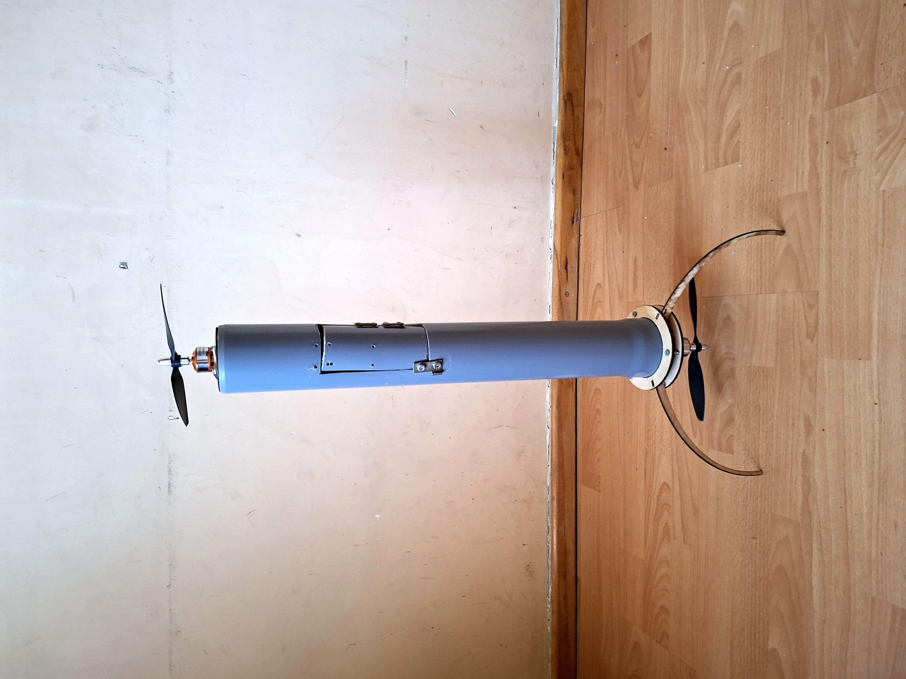
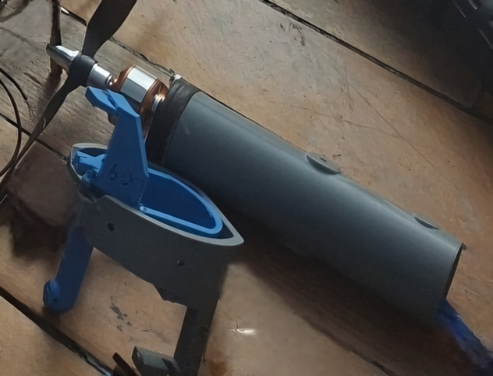

# 🚀 Autonomous Rocket Project
# 🚀 Автономная ракета
# 🚀 Ինքնավար հրթիռ

---

## 🇺🇸 English

### 📌 Project Description
This project focuses on the development and testing of an autonomous model rocket. The system utilizes custom 3D-printed aerodynamic body modules, a programmable microcontroller for stabilization, and a high-efficiency brushless propulsion system controlled via radio communication. It serves as an engineering platform to analyze thrust, stability, and flight data.

### 🛠 Components
* **Microcontroller:** Arduino Nano for flight control and data processing
* **Propulsion:** High-RPM brushless electric motor with an aerodynamic propeller
* **Speed Controller:** Electronic Speed Controller (ESC) for precise thrust management
* **Power Supply:** Voltage regulator step-down module providing stable power to the electronics
* **Fuselage:** Aerodynamic body parts designed and produced using 3D printing technology

### 📷 Media

*Figure 1: Rocket electronic and propulsion assembly*

*Figure 2: Custom 3D printed fuselage parts*

---

## 🇷🇺 Русский

### 📌 Описание проекта
Данный проект посвящён разработке и испытанию модели автономной ракеты. Система использует кастомные аэродинамические модули корпуса, напечатанные на 3D-принтере, программируемый микроконтроллер для стабилизации и высокоэффективную бесколлекторную силовую установку, управляемую по радиоканалу. Проект служит инженерной платформой для анализа тяги, устойчивости и полётных данных.

### 🛠 Компоненты
* **Микроконтроллер:** Arduino Nano для управления полётом и обработки данных
* **Двигатель:** Высокооборотный бесколлекторный электродвигатель с аэродинамическим пропеллером
* **Регулятор скорости:** Электронный регулятор скорости (ESC) для точного управления тягой
* **Питание:** Понижающий модуль стабилизации напряжения для обеспечения надёжной работы электроники
* **Корпус:** Аэродинамические элементы конструкции, разработанные и изготовленные с помощью 3D-печати

### 📷 Медиафайлы

*Рисунок 1: Электронная и силовая сборка ракеты*

*Рисунок 2: Элементы корпуса, напечатанные на 3D-принтере*
---

## 🇦🇲 Հայերեն

### 📌 Նախագծի նկարագրությունը
Այս նախագիծը նվիրված է ինքնավար մոդելային հրթիռի մշակմանն ու փորձարկմանը: Համակարգն օգտագործում է եռաչափ տպագրությամբ պատրաստված հրթիռի մարմնի օդադինամիկ տարրեր, կայունացման համար նախատեսված ծրագրավորվող միկրոկառավարիչ և ռադիոկապով կառավարվող բարձր արդյունավետության էլեկտրական շարժիչ: Նախագիծը ծառայում է որպես ինժեներական հարթակ՝ քարշուժի, կայունության և թռիչքային տվյալների վերլուծության համար:

### 🛠 Բաղադրիչներ
* **Միկրոկառավարիչ:** Arduino Nano՝ թռիչքի կառավարման և տվյալների մշակման համար
* **Շարժիչ:** Բարձր պտույտներով անխոզանակ էլեկտրական շարժիչ՝ օդադինամիկ պրոպելերով
* **Արագության կարգավորիչ:** Էլեկտրոնային հանգույց՝ քարշուժի հզորությունը ճշգրիտ կառավարելու համար
* **Սնուցում:** Լարման իջեցնող և կայունացնող մոդուլ՝ էլեկտրոնիկայի անխափան աշխատանքն ապահովելու համար
* **Մարմին (Կորպուս):** Օդադինամիկ կառուցվածքի տարրեր՝ նախագծված և պատրաստված եռաչափ տպագրության տեխնոլոգիայով

### 📷 Պատկերներ

*Պատկեր 1. Հրթիռի էլեկտրոնային և շարժիչային համակարգի հավաքումը*

*Պատկեր 2. Եռաչափ տպագրությամբ պատրաստված մարմնի դետալները**
